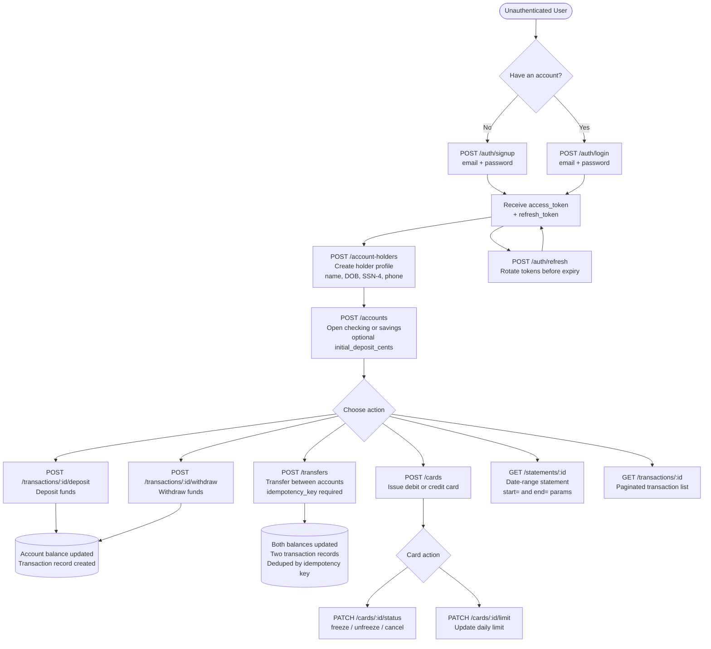

# Banking REST Service

A production-grade banking API built with Claude and Copilot. The project consists of:

* **Service core interface:** sign-up, accounts, transactions, etc
* **DB** using SQLIte for simplicity
* **Simple UI** for tests
* Test coverage
* Documentation

Built using AI-assisted development. See [`docs/AI_log.md`](docs/AI_log.md) for the full AI usage report.

> ### [Watch the walkthrough video](https://www.loom.com/share/78f4a0d027314f24ba7ffecadd31ff28)

---

## Quick Start

### Local (Python 3.12+)

```bash
# 1. Clone and enter the project
git clone <repo-url>
cd banking_rest_service

# 2. Create and activate a virtual environment
python -m venv .venv
source .venv/bin/activate        # Windows: .venv\Scripts\activate

# 3. Install dependencies
pip install -r requirements.txt

# 4. Set required environment variables
export JWT_SECRET_KEY="your-secret-key-here"

# 5. Run the server
uvicorn app.main:app --reload
```

API available at `http://localhost:8000`
Interactive docs at `http://localhost:8000/docs`

### Docker

```bash
# Build and start
docker-compose up --build

# Or build manually
docker build -t banking-api .
docker run -p 8000:8000 -e JWT_SECRET_KEY=your-secret banking-api
```

---

## Configuration

Settings are loaded from environment variables or a `.env` file in the project root.

| Variable                        | Default       | Description                                       |
| ------------------------------- | ------------- | ------------------------------------------------- |
| `JWT_SECRET_KEY`              | `CHANGE_ME` | **Required in production.** Signs all JWTs  |
| `JWT_ALGORITHM`               | `HS256`     | JWT signing algorithm                             |
| `ACCESS_TOKEN_EXPIRE_MINUTES` | `30`        | Access token lifetime                             |
| `REFRESH_TOKEN_EXPIRE_DAYS`   | `7`         | Refresh token lifetime                            |
| `CORS_ORIGINS`                | `["*"]`     | Allowed CORS origins — restrict before deploying |

The SQLite database is created automatically at `app/data_db/banking.db` on first startup.

---

## Project Structure

```
banking_rest_service/
├── app/
│   ├── api/v1/
│   │   ├── routes/          # Route handlers (auth, accounts, cards, …)
│   │   └── api.py           # Router registration
│   ├── core/
│   │   ├── config.py        # Settings (pydantic-settings)
│   │   ├── deps.py          # FastAPI dependencies (auth, ownership checks)
│   │   └── security.py      # JWT + bcrypt helpers
│   ├── db/
│   │   ├── base.py          # SQLAlchemy declarative base
│   │   └── session.py       # Engine + session factory (WAL + FK pragmas)
│   ├── models/              # SQLAlchemy ORM models
│   ├── schemas/             # Pydantic v2 request/response schemas
│   ├── services/            # Business logic layer
│   └── utils/               # card_utils, validators, account_number
├── tests/                   # pytest integration test suite
├── docs/                    # Security, roadmap, AI usage report
├── frontend/                # Vanilla JS UI (multi-page)
├── Dockerfile
├── docker-compose.yml
└── requirements.txt
```

---

## API Reference

All endpoints are prefixed with `/api/v1`. Protected endpoints require:

```
Authorization: Bearer <access_token>
```

**Money is represented in integer cents** throughout the API (`amount_cents: 2500` = $25.00).

### Auth — `/api/v1/auth`

| Method   | Path         | Auth | Status | Description                                         |
| -------- | ------------ | ---- | ------ | --------------------------------------------------- |
| `POST` | `/signup`  | —   | 201    | Register. Returns access + refresh tokens           |
| `POST` | `/login`   | —   | 200    | Login. Same error for wrong email or wrong password |
| `POST` | `/refresh` | —   | 200    | Exchange a refresh token for a new token pair       |
| `GET`  | `/me`      | ✓   | 200    | Current user info + account holder profile          |

Password rules: 8+ characters, at least one uppercase, lowercase, digit, and special character.

**Signup / Login body:**

```json
{ "email": "alice@example.com", "password": "Secure1!" }
```

**Token response:**

```json
{ "access_token": "…", "refresh_token": "…", "token_type": "bearer" }
```

## Technology Stack

| Layer            | Technology                                                       | Rationale                                               |
| ---------------- | ---------------------------------------------------------------- | ------------------------------------------------------- |
| Framework        | [FastAPI](https://fastapi.tiangolo.com/)                            | Modern Python web framework with automatic OpenAPI docs |
| Database         | SQLite +[SQLAlchemy 2.0](https://www.sqlalchemy.org/)               | Lightweight relational DB; WAL mode + FK enforcement    |
| Auth             | JWT via[python-jose](https://github.com/mpdavis/python-jose)        | Stateless, industry-standard authentication             |
| Password Hashing | [passlib](https://passlib.readthedocs.io/) + bcrypt                 | Secure credential storage                               |
| Validation       | [Pydantic v2](https://docs.pydantic.dev/)                           | Runtime type validation built into FastAPI              |
| Testing          | [pytest](https://pytest.org/) + [httpx](https://www.python-httpx.org/) | Async-compatible API integration tests                  |

---

## User Flow



---

## UI

The frontend is served at `http://localhost:8000` when the server is running. A multi-page vanilla JS client with a live API log panel showing raw requests and responses.

| Page            | Path           | Purpose                   |
| --------------- | -------------- | ------------------------- |
| Login / Sign up | `/`          | Auth                      |
| Dashboard       | `/app`       | Profile + account list    |
| Transfers       | `/transfers` | Transfer between accounts |
| Cards           | `/cards`     | Card management           |

---

## Documentation

| Document                                    | Description                                                         |
| ------------------------------------------- | ------------------------------------------------------------------- |
| [`docs/DocSecurity.md`](docs/DocSecurity.md) | Security protections, risks considered, and what is out of scope    |
| [`docs/DocRoadmap.md`](docs/DocRoadmap.md)   | Phased roadmap from prototype to production                         |
| [`docs/AI_log.md`](docs/AI_log.md)           | AI usage report — tools, prompts, challenges, manual interventions |

### Account Holders — `/api/v1/account-holders`

One profile per user. Must exist before opening accounts.

| Method   | Path    | Auth | Status | Description                          |
| -------- | ------- | ---- | ------ | ------------------------------------ |
| `POST` | `/`   | ✓   | 201    | Create holder profile                |
| `GET`  | `/me` | ✓   | 200    | Get own profile                      |
| `PUT`  | `/me` | ✓   | 200    | Update profile (all fields optional) |

**Create body:**

```json
{
  "first_name": "Alice",
  "last_name": "Smith",
  "date_of_birth": "1990-01-15",
  "phone": "+14155550100",
  "address": "1 Market St, San Francisco, CA 94105",
  "ssn_last_four": "1234"
}
```

---

### Accounts — `/api/v1/accounts`

| Method    | Path             | Auth | Status | Description                                                                    |
| --------- | ---------------- | ---- | ------ | ------------------------------------------------------------------------------ |
| `POST`  | `/`            | ✓   | 201    | Open account (`checking` or `savings`). Optional `initial_deposit_cents` |
| `GET`   | `/`            | ✓   | 200    | List own accounts                                                              |
| `GET`   | `/all`         | —   | 200    | List all active accounts (used for transfer destination lookup)                |
| `GET`   | `/{id}`        | ✓   | 200    | Get single account (ownership enforced)                                        |
| `PATCH` | `/{id}/status` | ✓   | 200    | Set `active`, `frozen`, or `closed`. Cannot close with non-zero balance  |

**Create body:**

```json
{ "account_type": "checking", "initial_deposit_cents": 100000 }
```

**Status update body:**

```json
{ "status": "frozen" }
```

---

### Transactions — `/api/v1/transactions`

| Method   | Path                       | Auth | Status | Description                                                            |
| -------- | -------------------------- | ---- | ------ | ---------------------------------------------------------------------- |
| `POST` | `/{account_id}/deposit`  | ✓   | 200    | Deposit funds. Rejected on frozen/closed accounts                      |
| `POST` | `/{account_id}/withdraw` | ✓   | 200    | Withdraw funds. Rejected if insufficient balance or account not active |
| `GET`  | `/{account_id}`          | ✓   | 200    | Paginated transaction list with optional type filter                   |

**Deposit / Withdraw body:**

```json
{ "amount_cents": 5000, "description": "Optional note" }
```

**List query params:** `?page=1&page_size=20&transaction_type=deposit`

`transaction_type` values: `deposit`, `withdrawal`, `transfer_in`, `transfer_out`

---

### Transfers — `/api/v1/transfers`

Atomic debit + credit across any two active accounts. Both sides roll back on failure.

| Method   | Path  | Auth | Status | Description                                                                                     |
| -------- | ----- | ---- | ------ | ----------------------------------------------------------------------------------------------- |
| `POST` | `/` | ✓   | 201    | Execute transfer. Duplicate `idempotency_key` returns the original record without re-debiting |

**Body:**

```json
{
  "idempotency_key": "550e8400-e29b-41d4-a716-446655440000",
  "from_account_id": "<uuid>",
  "to_account_id": "<uuid>",
  "amount_cents": 10000,
  "description": "Rent"
}
```

---

### Cards — `/api/v1/cards`

Max 3 active cards per account. Full card number is never stored (SHA-256 hash + last 4 only).

| Method     | Path             | Auth | Status | Description                                  |
| ---------- | ---------------- | ---- | ------ | -------------------------------------------- |
| `POST`   | `/`            | ✓   | 201    | Issue a card                                 |
| `GET`    | `/`            | ✓   | 200    | List all cards for the current holder        |
| `GET`    | `/{id}`        | ✓   | 200    | Get a single card                            |
| `PATCH`  | `/{id}/status` | ✓   | 200    | Set `active`, `frozen`, or `cancelled` |
| `PATCH`  | `/{id}/limit`  | ✓   | 200    | Update daily spending limit                  |
| `DELETE` | `/{id}`        | ✓   | 204    | Delete a card                                |

**Issue body:**

```json
{
  "account_id": "<uuid>",
  "card_number": "4111111111111111",
  "card_type": "debit",
  "expiry_month": 12,
  "expiry_year": 2028,
  "daily_limit": 500.00
}
```

---

### Statements — `/api/v1/statements`

| Method  | Path              | Auth | Status | Description                  |
| ------- | ----------------- | ---- | ------ | ---------------------------- |
| `GET` | `/{account_id}` | ✓   | 200    | Date-range account statement |

**Query params:** `?start=2024-01-01&end=2024-01-31`

**Response includes:** `opening_balance_cents`, `closing_balance_cents`, `total_deposits_cents`, `total_withdrawals_cents`, `transaction_count`, and full `transactions` list for the period.

---

## Running Tests

```bash
# Full suite
.venv/bin/pytest tests/ -v

# Single module
.venv/bin/pytest tests/test_transfers.py -v

# With coverage
.venv/bin/pytest tests/ --cov=app --cov-report=term-missing
```

The suite uses an isolated SQLite database per test — no external services required. **75 tests, all passing.**

---

## TODO

* [X] TC: Establish tech-stack
* [X] SC: Source code with core components, config files, test units
* [X] BP: Test client application for the flow + UI
* [X] DocAI: AI usage report
* [X] DocSecurity: Security considerations document
* [X] DocRoadmap: Roadmap document
* [X] Polish final repo before submitting
* [X] Make a Loom walkthrough video
