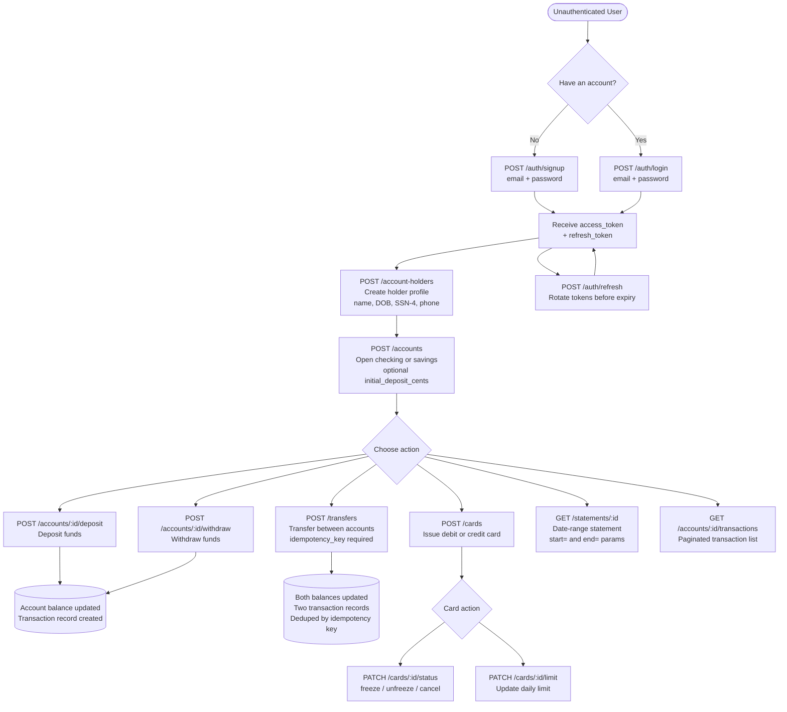

# AI-Driven Development Test: Banking REST Service

A RESTful banking API built with AI-driven development practices. This service provides core banking functionality including account management, transactions, money transfers, card management, and statement generation.

## Project Requirements

### Core Components:

1. **Service Interface**
   ● Signing up
   ● Authentication
   ● Account Holders
   ● Accounts
   ● Transactions
   ● Money Transfer
   ● Cards
   ● Statements
2. **Database** (using SQLite)
   ● Database implementation
3. **Test Suite** (not a hard requirement as the focus is more on your code)
   ● Comprehensive test coverage for critical functionality
   ● Unit tests for business logic
   ● Integration tests for API endpoints

## Technology Stack

| Layer            | Technology                                                       | Rationale                                                      |
| ---------------- | ---------------------------------------------------------------- | -------------------------------------------------------------- |
| Framework        | [FastAPI](https://fastapi.tiangolo.com/)                            | Modern, async Python web framework with automatic OpenAPI docs |
| Database         | SQLite +[SQLAlchemy](https://www.sqlalchemy.org/)                   | Lightweight relational DB with a powerful Python ORM           |
| Auth             | JWT (via[python-jose](https://github.com/mpdavis/python-jose))      | Stateless, industry-standard authentication                    |
| Password Hashing | [passlib](https://passlib.readthedocs.io/) + bcrypt                 | Secure credential storage                                      |
| Validation       | [Pydantic v2](https://docs.pydantic.dev/)                           | Runtime type validation built into FastAPI                     |
| Testing          | [pytest](https://pytest.org/) + [httpx](https://www.python-httpx.org/) | Async-compatible test client for API integration tests         |
| Migrations       | [Alembic](https://alembic.sqlalchemy.org/)                          | Schema versioning for SQLite                                   |

## Architecture

## User Flow

## UI Usage (Manual Flow)

1. **Start the API**

* `uvicorn app.main:app --reload`

2. **Open the UI**

* Go to: `http://127.0.0.1:8000/`

3. **Set API Base URL**

* Top bar → keep default `http://127.0.0.1:8000` (or change if needed)

4. **Sign Up**

* **Auth** panel → enter email + strong password → **Sign Up**

5. **Log In**

* **Auth** panel → same email/password → **Log In**
* Token is stored automatically for all requests

6. **Create Profile**

* **Account Holder** panel → fill profile → **Create Profile**

7. **Open Account**

* **Accounts** panel → choose type/currency, optional initial deposit (in cents) → **Open Account**

8. **Deposit**

* **Deposit** panel → select account → enter `amount_cents` → **Deposit**

9. **View Transactions**

* **Transactions** panel → select account, page/page_size → **Fetch**

10. **Transfer**

* **Transfer** panel → set idempotency key, from/to accounts, `amount_cents` → **Transfer**

11. **Statements**

* **Statements** panel → choose account, start/end date → **Get Statement**

12. **Cards (optional)**

* **Cards** panel → issue card or change status (freeze/unfreeze)

**API Log Panel**

* Bottom/right panel shows raw requests and responses for every action.

## TODO

* [X] TC: Establish tech-stack - prompt to select the tech-stack for the project
* [X] SC: Source code with core components for service/DB development, config files, test units
* [X] BP: Test client application for the flow + UI
* [X] DocAI: Track progress of AI usage - report of tools, prompts, challenges solved with AI, manual interventions
* [X] DocSecurity: Security considerations document
* [ ] DocRoadmap: Roadmap document for future considerations
